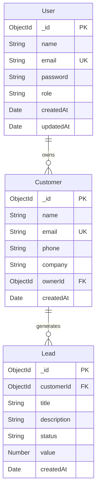

# Mini CRM – Full Stack MERN Application

This project demonstrates backend, frontend, database, and integration expertise using the **MERN stack**.

---

## 🚀 Live Demo

- **Frontend (Vercel)**: [https://lead-flow-theta.vercel.app/](https://lead-flow-theta.vercel.app/)  
- **Backend API (AWS)**: [https://leadflow-backend.publicvm.com](https://leadflow-backend.publicvm.com/)  

🔑 **Test Credentials**  
**Email**: `yash@pandav.com`
**Password**: `Yashpandav2006@`


## 📸 Project Preview


# **Demo Video:** [Watch here](https://drive.google.com/open?id=1oXlP1TMBQBXHjqe9jkCUdSv9GlzH7GbK&usp=drive_copy)

---

## ✨ Features

### Authentication
- Register new users
- Secure login with JWT
- Passwords stored as bcrypt hashes
- Protected routes

### Customers Management
- Add, edit, delete customers
- Pagination & search by name/email
- View customer details (with associated leads)

### Leads Management
- Each customer can have multiple leads
- Fields: title, description, status (New, Contacted, Converted, Lost), value, createdAt
- CRUD operations for leads
- Filter leads by status

### Dashboard & Reports
- Metrics: total customers, total leads, new customers, conversion rate
- Charts: 
  - Leads by status (Pie/Bar)
  - Leads in last 7 days (Line/Bar)
- Top customers diagram
- Recent leads table
- Reports tab with customer & lead summary tables

### Bonus (Implemented)
- Context API for state management
- Request validation with Yup.
- Responsive design (desktop & mobile)
- Toast notifications for feedback
- Deployed backend + frontend

---

## 🛠️ Tech Stack

### Frontend
- React (Vite)
- Tailwind CSS + ShadCN UI
- React Router DOM
- Axios
- Recharts
- Context API
- Request validation with Yup.

### Backend
- Node.js + Express.js
- MongoDB Atlas + Mongoose
- JWT for authentication
- bcrypt for password hashing
- Morgan for logging
- CORS enabled

---

## 🗂️ Project Structure

## Root Directory
```
.
├── API_DOCUMENTATION.md              # API endpoint documentation and usage guide
├── PROJECT_STRUCTURE.md              # Project Structure
├── components.json                   # shadcn/ui component configuration
├── eslint.config.js                  # Code linting rules and standards
├── index.html                        # Entry point for Vite development server
├── jsconfig.json                     # JavaScript project configuration for IDE support
├── package.json                      # Frontend dependencies and scripts
├── package-lock.json
├── postcss.config.cjs               # PostCSS configuration for Tailwind processing
├── public
│   └── vite.svg
├── README.md
├── tailwind.config.js               # Tailwind CSS configuration and theme customization
└── vite.config.js                   # Vite bundler configuration and build settings
```

## Server Directory
```
Server/
├── index.js                         # Express server entry point and middleware setup
├── package.json                     # Backend dependencies and server scripts
├── package-lock.json
├── README.md
└── src/
    ├── config/
    │   └── db.js                    # Database connection configuration
    ├── controllers/                 # Business logic handlers for routes
    │   ├── authController.js        # User authentication and authorization logic
    │   ├── customerController.js    # Customer CRUD operations
    │   ├── dashboardController.js   # Dashboard data aggregation
    │   ├── leadController.js        # Lead management operations
    │   └── reportController.js      # Report generation logic
    ├── middleware/
    │   ├── auth.js                  # JWT token validation middleware
    │   └── leadAuthorization.js     # Lead access permission checks
    ├── models/                      # Database schema definitions
    │   ├── customer.js              # Customer data model and validation
    │   ├── lead.js                  # Lead data model and validation
    │   └── user.js                  # User authentication model
    └── routes/                      # API endpoint definitions
        ├── auth.js                  # Authentication routes (/login, /register)
        ├── customer.js              # Customer management endpoints
        ├── dashboard.js             # Dashboard data endpoints
        ├── leads.js                 # Lead management endpoints
        └── report.js                # Report generation endpoints
```

## Frontend Source Directory
```
src/
├── App.css
├── App.jsx                          # Main application component and routing setup
├── assets/
│   └── react.svg
├── components/
│   ├── Layout.jsx                   # Common page layout wrapper
│   ├── Navbar.jsx                 
│   ├── PrivateRoute.jsx             # Route protection for authenticated users
│   └── ui/                          # Reusable UI components (shadcn/ui)
│       ├── avatar.jsx
│       ├── badge.jsx
│       ├── button.jsx
│       ├── card.jsx
│       ├── dialog.jsx
│       ├── dropdown-menu.jsx
│       ├── input.jsx
│       ├── label.jsx
│       ├── LeadCard.jsx            
│       ├── LoadingSpinner.jsx      
│       ├── Pagination.jsx         
│       ├── select.jsx
│       ├── sidebar.jsx
│       ├── sonner.jsx
│       ├── table.jsx
│       └── textarea.jsx
├── config/
│   └── theme.js                     # Application theme configuration
├── contexts/
│   └── ApiContext.jsx               # Global API state management context
├── index.css                        # Global styles and Tailwind imports
├── lib/
│   └── utils.js                     # Utility functions and class name helpers
├── main.jsx                         # React application entry point
├── pages/                           # Page components organized by feature
│   ├── Auth/
│   │   ├── Login.jsx                # User login form
│   │   └── Register.jsx             # User registration form
│   ├── Customers/
│   │   ├── CustomerDetail.jsx       # Individual customer view
│   │   ├── CustomerForm.jsx         # Customer creation/editing form
│   │   └── CustomersList.jsx        # Customer listing with search/filter
│   ├── Dashboard/
│   │   └── Dashboard.jsx            # Main dashboard with analytics
│   ├── Leads/
│   │   ├── LeadDetail.jsx          # Individual lead view
│   │   ├── LeadForm.jsx            # Lead creation/editing form
│   │   └── LeadsList.jsx           # Lead listing with management features
│   ├── NotFound.jsx                # 404 error page
│   └── Reports/
│       └── Reports.jsx             # Report generation and viewing
├── services/
│   └── api.js                      # API client configuration and endpoints
└── store/                          # Redux store configuration
    ├── features/                   # Feature-based state slices
    │   ├── customer/
    │   │   └── customerSlice.js    # Customer state management
    │   ├── dashboard/
    │   │   └── dashboardSlice.js   # Dashboard data state
    │   ├── leads/
    │   │   └── leadSlice.js        # Lead management state
    │   └── report/
    │       └── reportSlice.js      # Report data state
    └── index.js                    # Redux store configuration and setup
```

## Architecture Overview

This project follows a **full-stack React + Node.js architecture** with:

- **Frontend**: React 18 with Vite, Tailwind CSS, and shadcn/ui components
- **State Management**: Redux Toolkit for global state
- **Backend**: Node.js with Express.js REST API
- **Database**: Configured through db.js (MongoDB)
- **Authentication**: JWT-based auth with protected routes
- **Styling**: Tailwind CSS with custom theme configuration

## Key Design Patterns

- **Feature-based organization** for scalable code structure
- **Component composition** with reusable UI elements
- **Separation of concerns** between controllers, models, and routes
- **Context API** for global application state
- **Middleware pattern** for authentication and authorization

## Schema


# ⚙️ Project Setup

This document explains how to set up and run the project locally.  
The application is built using the **MERN stack**: MongoDB, Express, React, and Node.js.

---

## 1. Prerequisites

Make sure you have the following installed:

- [Node.js](https://nodejs.org/) (v18 or above recommended)
- [npm](https://www.npmjs.com/) or [yarn](https://yarnpkg.com/)  
- [MongoDB Atlas](https://www.mongodb.com/atlas) account (or local MongoDB instance)
- Git

---

## 2. Clone the Repository

```bash
git clone https://github.com/yashpandav/LeadFlow.git
cd LeadFlow
```

## 3. Installation
```
npm install
cd Server
npm install

```

## 4. ENV Setup /Server
```
PORT=8080
MONGO_URI=<your-mongodb-atlas-uri>
JWT_SECRET=<your-secret-key>
```

## 5. ENV Setup 
```
VITE_API_BASE_URL = http://localhost:8080/api
```

## 6. Server Start
- Inside /Server 
```
npm run dev
```

## 7. Client Start
- Inside / 
```
npm run dev
```

### Notes
- Deployed on Render (backend) & Vercel (frontend).
- Free-tier hosting may cause initial cold start delays.
- Use provided test credentials for quick access.

### Evaluation Highlights
- Clean & modular code
- Proper architecture for backend & frontend
- Fully functional: Auth, customers, leads, dashboard, reports
- Responsive UI & modern design
- Deployment done (frontend + backend)
- Bonus features implemented (charts, toast, context API)

### Project Highlights
[https://drive.google.com/drive/folders/1OKJcSkBObPTgS-k9725DNHkgDb2BVHyY?usp=sharing](https://drive.google.com/drive/folders/1OKJcSkBObPTgS-k9725DNHkgDb2BVHyY?usp=sharing) 


### Thank You
